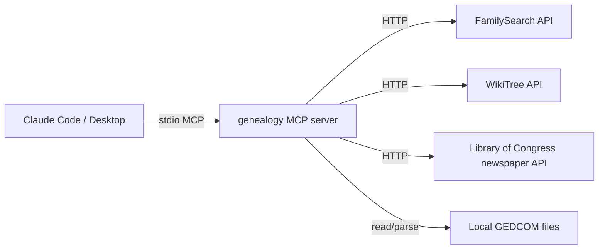

# Architecture

Genealogy is a Python tool exposing research automation as an MCP server. Claude (Code or Desktop) is the front-end.

## Components

## Modules

- `src/genealogy/` — core library: GEDCOM parsing (ged4py), record search, evidence-bundling synthesis, dead-end discovery with era-aware scoring
- `src/genealogy_mcp/` — MCP server wrapping the core library; 13 tools exposed via stdio
- `tests/` — pytest suite
- `data/` — sample GEDCOM, fixtures
- `scripts/verify_real_data.py` — out-of-band smoke test for the external clients

## Design rules

- **Ancestry.com is read-only** — no scraping. Data via GEDCOM export/import only.
- **FamilySearch + WikiTree + LoC** for programmatic record search.
- **MCP is the interface** — Claude drives research sessions via tools.
- **Jason stays in the loop** for all genealogical decisions (provenance, conflict resolution).